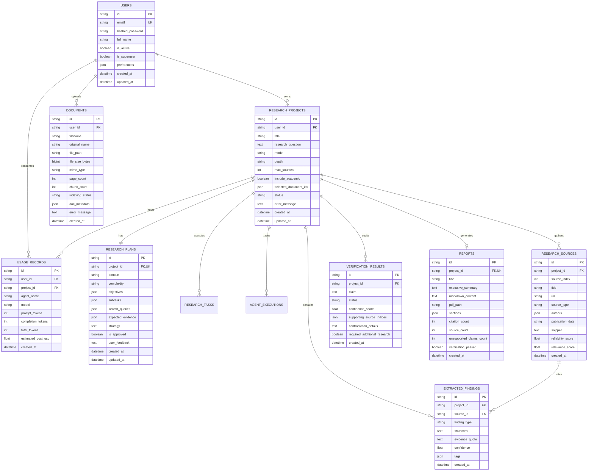

# NEXUS AI: Relational Database Schema & Entities

The relational database is normalized and designed with SQLAlchemy 2.0 async paradigms, compatible with PostgreSQL 16+ and SQLite.

```mermaid
erDiagram
    USERS ||--o{ RESEARCH_PROJECTS : owns
    USERS ||--o{ DOCUMENTS : uploads
    USERS ||--o{ USAGE_RECORDS : consumes

    RESEARCH_PROJECTS ||--|| RESEARCH_PLANS : has
    RESEARCH_PROJECTS ||--o{ RESEARCH_TASKS : executes
    RESEARCH_PROJECTS ||--o{ AGENT_EXECUTIONS : traces
    RESEARCH_PROJECTS ||--o{ RESEARCH_SOURCES : gathers
    RESEARCH_PROJECTS ||--o{ EXTRACTED_FINDINGS : contains
    RESEARCH_PROJECTS ||--o{ VERIFICATION_RESULTS : audits
    RESEARCH_PROJECTS ||--o| REPORTS : generates
    RESEARCH_PROJECTS ||--o{ USAGE_RECORDS : incurs

    RESEARCH_SOURCES ||--o{ EXTRACTED_FINDINGS : cites

    USERS {
        string id PK
        string email UK
        string hashed_password
        string full_name
        boolean is_active
        boolean is_superuser
        json preferences
        datetime created_at
        datetime updated_at
    }

    RESEARCH_PROJECTS {
        string id PK
        string user_id FK
        string title
        text research_question
        string mode
        string depth
        int max_sources
        boolean include_academic
        json selected_document_ids
        string status
        text error_message
        datetime created_at
        datetime updated_at
    }

    RESEARCH_PLANS {
        string id PK
        string project_id FK,UK
        string domain
        string complexity
        json objectives
        json subtasks
        json search_queries
        json expected_evidence
        text strategy
        boolean is_approved
        text user_feedback
        datetime created_at
        datetime updated_at
    }

    RESEARCH_SOURCES {
        string id PK
        string project_id FK
        int source_index
        string title
        string url
        string source_type
        json authors
        string publication_date
        text snippet
        float reliability_score
        float relevance_score
        datetime created_at
    }

    EXTRACTED_FINDINGS {
        string id PK
        string project_id FK
        string source_id FK
        string finding_type
        text statement
        text evidence_quote
        float confidence
        json tags
        datetime created_at
    }

    VERIFICATION_RESULTS {
        string id PK
        string project_id FK
        text claim
        string status
        float confidence_score
        json supporting_source_indices
        text contradiction_details
        boolean required_additional_research
        datetime created_at
    }

    REPORTS {
        string id PK
        string project_id FK,UK
        string title
        text executive_summary
        text markdown_content
        string pdf_path
        json sections
        int citation_count
        int source_count
        int unsupported_claims_count
        boolean verification_passed
        datetime created_at
    }

    DOCUMENTS {
        string id PK
        string user_id FK
        string filename
        string original_name
        string file_path
        bigint file_size_bytes
        string mime_type
        int page_count
        int chunk_count
        string indexing_status
        json doc_metadata
        text error_message
        datetime created_at
    }

    USAGE_RECORDS {
        string id PK
        string user_id FK
        string project_id FK
        string agent_name
        string model
        int prompt_tokens
        int completion_tokens
        int total_tokens
        float estimated_cost_usd
        datetime created_at
    }
```

